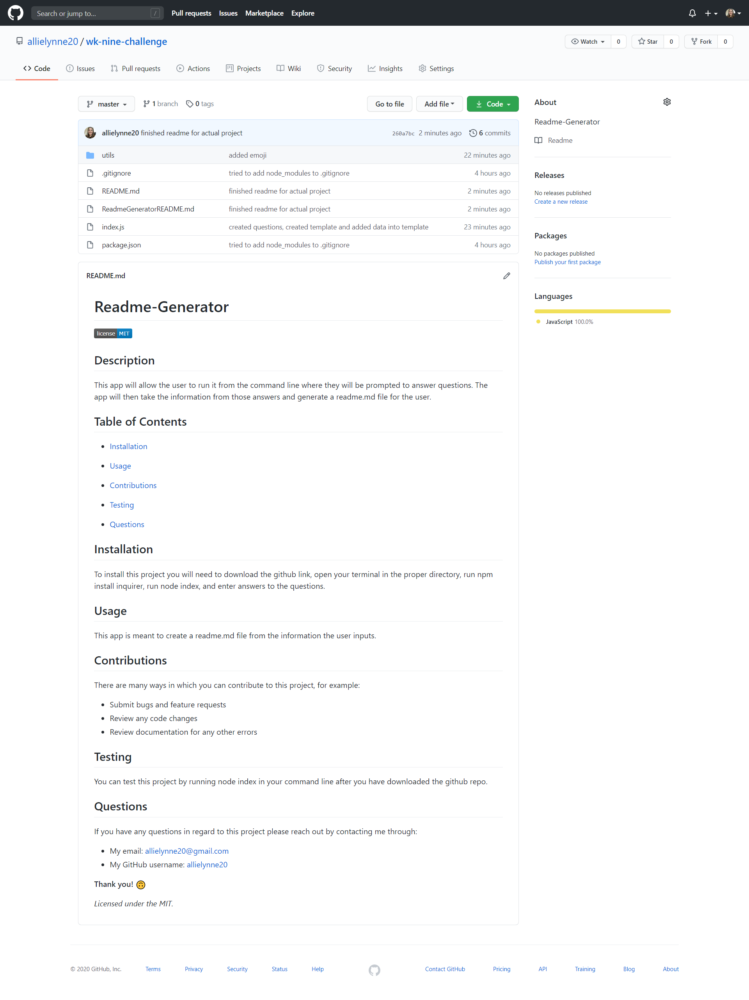

  # **Readme-Generator**

  

  ## **Description**
  This app will allow the user to run it from the command line where they will be prompted to answer questions. The app will then take the information from those answers and generate a readme.md file for the user.

  ## **Example Readme this app created!**
  

  ## **Table of Contents**

  * [Installation](#Installation)

  * [Usage](#Usage)

  * [Contributions](#Contributions)

  * [Testing](#Testing)

  * [Questions](#Questions)

  ## **Installation**
  To install this project you will need to download the github link, open your terminal in the proper directory, run npm install inquirer, run node index, and enter answers to the questions.

  ## **Usage**
  This app is meant to create a readme.md file from the information the user inputs.
  - Here is a video that shows you how to create a reademe file with this application: [readme video](https://drive.google.com/file/d/12ojqxP2nI_m-lkXCzbLBd_hT7Vp793Pf/view) 

  ## **Contributions**
  There are many ways in which you can contribute to this project, for example:
  - Submit bugs and feature requests
  - Review any code changes 
  - Review documentation for any other errors

  ## **Testing**
  You can test this project by running node index in your command line after you have downloaded the github repo.

  ## **Questions** 
  If you have any questions in regard to this project please reach out by contacting me through: 
  - My email: allielynne20@gmail.com
  - My GitHub username: [allielynne20](https://github.com/allielynne20)

  **Thank you!** :upside_down_face:

  *Licensed under the MIT.*
  
